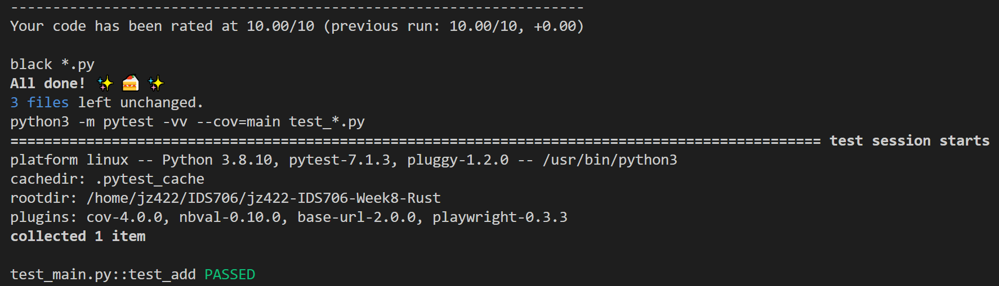

# Python vs. Rust

This repository sets up an environment on CodeSpaces and uses GitHub Actions to run a Makefile for the following commands: make install, make test, make format, and make lint.

## Getting Started
To set up the project, simply run make all or run make install and make test.

## Features
### Data Analysis in Python using Pandas
Included is a Python script data_analysis.py that performs basic data analysis tasks using Pandas:

- Reads a dataset from a CSV file
- Computes descriptive statistics like mean, median, standard deviation, minimum, and maximum for a specified column.
- Calculates performance metrics, including the elapsed time, CPU usage, and memory usage during the execution.

#### How to Use the Data Analysis Script using Python
1. Place your CSV file in the same directory as the script or update the file_path variable in the script to point to your CSV file.
2. Run the script:

    **python3 data_analysis.py**

3. Check the output for summary statistics

### Data Analysis in Rust
A Rust script is also available, demonstrating the capabilities of Rust in data processing.

#### How to Use the Data Analysis Script using Rust
1. Place your CSV file in the same directory as the script or update the file_path variable in the script to point to your CSV file.
2. Run the script:

    **cargo run**

3. Check the output for summary statistics

## Performance Comparison Report: Python vs. Rust

This report presents a comparison of the performance metrics obtained from two scripts, one written in Python and the other in Rust. Both scripts perform descriptive statistics on given datasets.

## Performance Metrics

| Metric        | Python          | Rust            |
| ------------- | --------------- | --------------- |
| Elapsed Time  | 0.0073 seconds  | 2.712878ms      |
| CPU Usage     | 50.0%           | 0.70%           |
| Memory Usage  | 75.2%           | 70.87025%       |

## Analysis

- **Elapsed Time**: The Python script took 0.0073 seconds, while the Rust script executed in approximately 2.712878 milliseconds. The Rust script is notably faster, executing in a fraction of the time compared to the Python script.
  
- **CPU Usage**: The Python script utilized 50% of the CPU during its execution, whereas the Rust script was more efficient, using only 0.70% of the CPU.

- **Memory Usage**: Both scripts have comparable memory usage with the Python script consuming 75.2% and the Rust script using 70.87025% of the available memory.

## Conclusion

While the Rust script showed superior performance in terms of execution time and CPU usage, it's essential to note that the datasets or the operations might differ, given the significant variation in the descriptive statistics. In performance-critical applications, the Rust script's efficiency might be advantageous. However, the choice between Python and Rust should also consider other factors such as development time, ease of use, and the specific needs of the application.

## Project Structure
- **.devcontainer** includes a Dockerfile and devcontainer.json. The **Dockerfile** within this folder specifies how the container should be built, and other settings in this directory may control development environment configurations.
- **workflows** includes GitHub Actions, which contain configuration files for setting up automated build, test, and deployment pipelines for your project.
- **.gitignore** is used to specify which files or directories should be excluded from version control when using Git.
- **Makefile** is a configuration file used in Unix-based systems for automating tasks and building software. It contains instructions and dependencies for compiling code, running tests, and other development tasks.
- **README.md** is the instruction file for the readers.
- **requirements.txt** is to specify the dependencies (libraries and packages) required to run the project.
- **test_main.py** is a test file for main.py that can successfully run in IDEs.
- **main.py** is a Python file that contains the main function.
- **data_analysis.py** is a Python script for basic data analysis tasks using Pandas.
- **main.rs** is the main Rust file that runs the data analysis tasks and prints the results.
- **lib.rs** is a Rust library file that contains functions and structures used for data analysiss.

